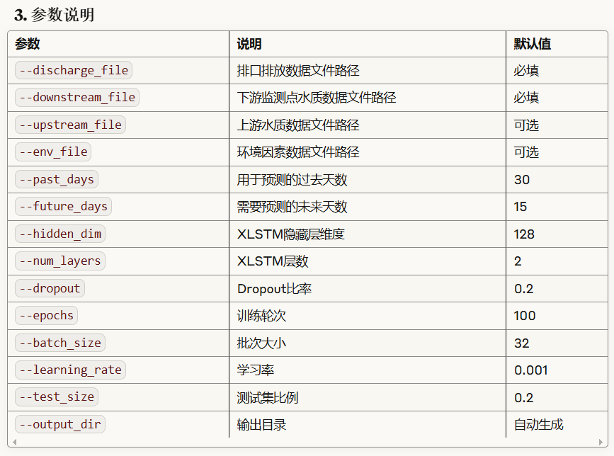

```bash
python discharge_impact_xlstm.py --discharge_file test_data/discharge_data.csv --downstream_file test_data/downstream_data.csv --only_validate
 ```

```bash
python discharge_impact_xlstm.py --discharge_file test_data/discharge_data.csv --downstream_file test_data/downstream_data.csv --upstream_file test_data/upstream_data.csv --env_file test_data/environment_data.csv --past_days 30 --future_days 15 --hidden_dim 128 --num_layers 2 --dropout 0.2 --epochs 100 --batch_size 32 --learning_rate 0.001 --test_size 0.2 --output_dir results_xlstm
 ```

